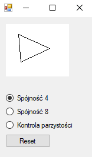
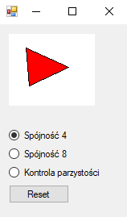
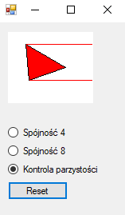

# OGK - Paweł Lipski 185IC A2 21716

### Zadanie 1: Wypełnienie obszaru

### W przypadku wybrania opcji:
### ► Spójność 4
### ► Spójność 8

### Należy kliknąć 3 razy w dowolne miejsce lpm, następnie kliknąć wewnątrz utworzonej figury, żeby wypełnić pole.

### W przypadku wybrania opcji:
### ► Kontrola parzystości

### Należy kliknąć 3 razy w dowolne miejsce lpm.

