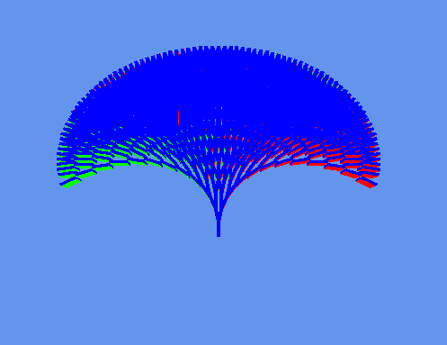

# OGK - Paweł Lipski 185IC A2 21716

### Zadanie 7: Zadanie indywidualne / Fraktale w OpenTK

### Obrót kamery za pomocą przycisków: x, y, z
### Zmiana odległości kamery przy użyciu scrolla myszki
### Zmiana ilości rekurencji linia 137 
### Zmiana kontu obrotu figury linia 151, 152

